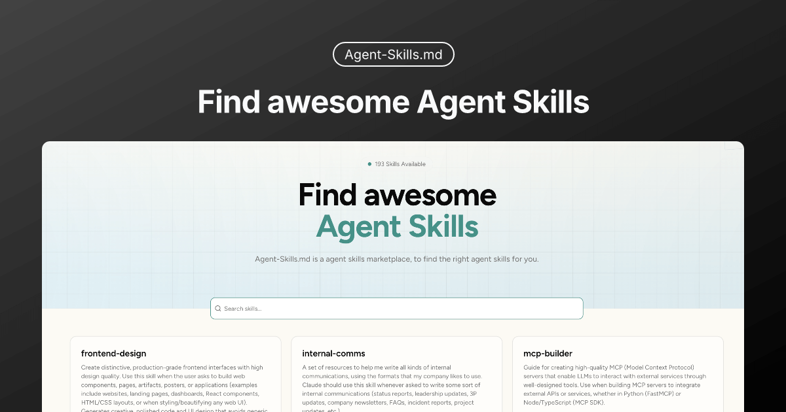

# Agent Skills



Agent Skills is a directory and explorer for AI agent skills. It indexes skill
repositories, lets you browse and preview SKILL.md instructions, and supports
downloading a complete skill folder for local use.

## Tech Stack

- Next.js (App Router)
- React
- TypeScript
- Tailwind CSS
- Drizzle ORM
- PostgreSQL
- oRPC

## Development

Install dependencies:

```bash
pnpm install
```

Start the dev server:

```bash
pnpm dev
```

Open http://localhost:3000 to view the app.


## Related Resources
- [Skill Hub](https://skill.442595.xyz/) — 5800+ curated AI Agent Skills for Claude Code, Codex, Cursor, Hermes & more across 22 categories.
